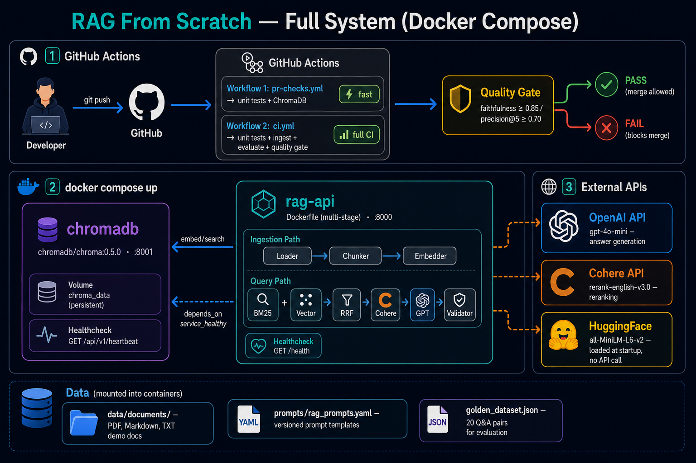
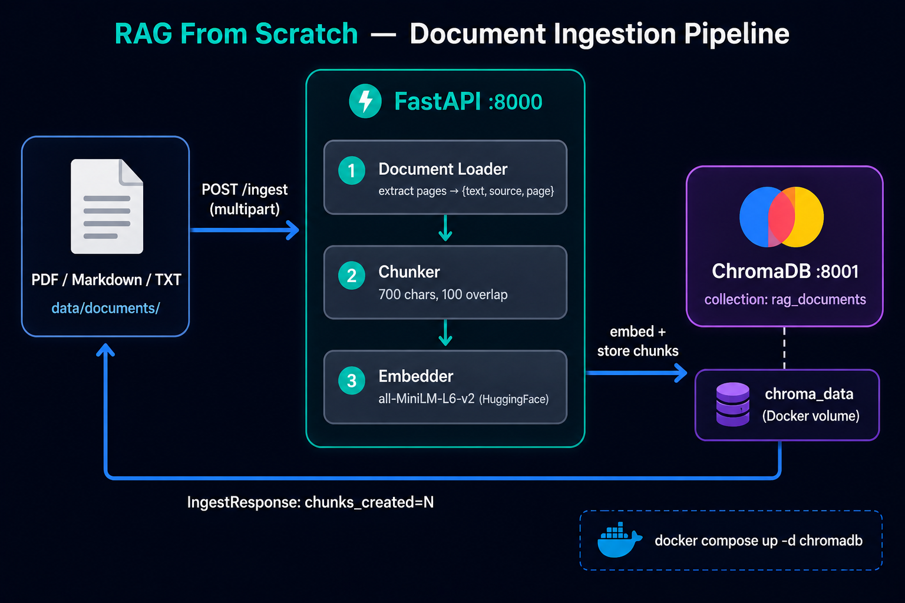
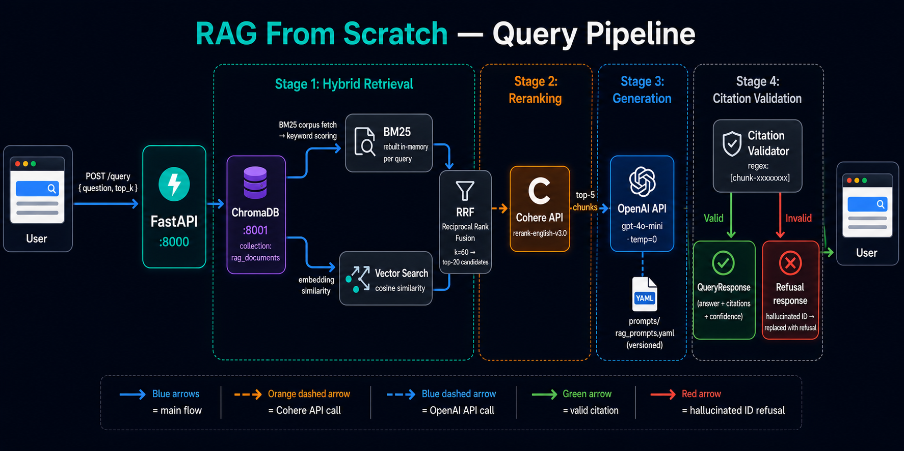

# Production-Grade RAG System

> Domain-specific question answering with hybrid retrieval, re-ranking, and automated quality gates


---

## Table of Contents

- [Project Description](#project-description)
- [Architecture](#architecture)
- [Tech Stack](#tech-stack)
- [How to Install and Run](#how-to-install-and-run)
- [How to Use](#how-to-use)
- [Project Structure](#project-structure)
- [What This Teaches](#what-this-teaches)
- [Challenges](#challenges)
- [API Reference](#api-reference)

---

## Project Description

A production-ready Retrieval Augmented Generation (RAG) system that answers questions from documents with proper citations. Built to demonstrate real-world AI engineering practices: hybrid search (BM25 + vector), cross-encoder re-ranking, citation enforcement, and CI/CD quality gates that automatically block PRs when metrics degrade. Not a tutorial — this is how senior AI engineers ship RAG to production.

Designed for: AI engineers building portfolio projects, teams deploying RAG in enterprise, learners who want to understand production RAG architecture.

What makes it different: Full evaluation pipeline with golden dataset, automated quality gates in CI, prompt versioning, and detailed metrics tracking (faithfulness, precision, latency P95).

---

## Architecture

### Full System (Docker Compose + CI/CD)


### Document Ingestion Pipeline


### Query & Answer Pipeline


---

## Tech Stack

| Technology | Role | Version |
|---|---|---|
| Python | Core language | 3.11+ |
| FastAPI | API framework | 0.111+ |
| LangChain | RAG orchestration | 0.2+ |
| ChromaDB | Vector database | 0.5+ |
| Sentence Transformers | Embeddings (all-MiniLM-L6-v2) | 2.7+ |
| rank-bm25 | Keyword search | 0.2.2 |
| Cohere | Cross-encoder re-ranker | 5.5+ |
| Ragas | RAG evaluation framework | 0.1.9 |
| OpenAI | LLM (gpt-4o-mini) | 1.30+ |
| Pydantic | Schema validation | 2.7+ |
| pypdf | PDF text extraction | 4.2+ |
| pytest | Testing framework | 8.2+ |
| Prometheus FastAPI Instrumentator | Metrics | 7.0+ |

---

## How to Install and Run

### Prerequisites
- Python 3.11+
- Docker & Docker Compose
- OpenAI API key (gpt-4o-mini)
- Cohere API key (rerank-english-v3.0)
- `jq` (used by ingest script for output formatting)
  - **Mac:** `brew install jq`
  - **Ubuntu/Debian:** `sudo apt install jq`
  - **Windows/Scoop:** `scoop install jq`
  - **Windows/winget:** `winget install jqlang.jq`
  - **Manual download:** https://jqlang.github.io/jq/download/
  - **Alternative:** skip `jq` and ingest manually — see Troubleshooting

### Steps

**1. Clone and configure**
```bash
git clone https://github.com/YOUR_USERNAME/project-01-production-rag-system.git
cd project-01-production-rag-system
cp .env.example .env
# Edit .env: add OPENAI_API_KEY and COHERE_API_KEY
```

**2. Install dependencies**
```bash
pip install -r requirements.txt
```

**3. Start services**
```bash
docker compose up -d
# Wait ~15 seconds for ChromaDB to initialize
```

On Windows/Git Bash, if Docker cannot read your normal Docker config, use a writable config path:
```bash
DOCKER_CONFIG=/d/tmp/docker-config docker compose up -d
```

**Where Docker images and data are stored**

This project does not require a remote Docker image registry for local development.

- `rag-api` is built locally from this repository because `docker-compose.yml` uses `build: .`
- The app image packages `src/` into `/app/src` and `prompts/` into `/app/prompts`
- During Docker Compose development, local `./src` and `./prompts` are mounted into the container, so those folders override the copies baked into the image
- `chromadb` is pulled from Docker Hub as `chromadb/chroma:0.5.0`
- ChromaDB vector data is stored in the Docker volume `chroma_data`

Useful inspection commands:
```bash
docker compose images
docker images
docker volume ls
```

After pulling new code, rebuild and restart the local stack:
```bash
docker compose up -d --build
```

**4. Ingest demo documents**
```bash
bash scripts/ingest_demo_docs.sh
# Uploads documents from data/documents/, chunks, embeds, stores in ChromaDB
```

**5. Query the system**
```bash
curl -X POST http://localhost:8000/query \
  -H "Content-Type: application/json" \
  -d '{"question": "What is the main cause of climate change?", "top_k": 5}'
```

**6. Run evaluation**
```bash
bash scripts/run_evaluation.sh
# Expected: takes ~1-2 minutes and returns passed=true when thresholds are met
```

---

## How to Use

**Ask a question:**
```bash
curl -X POST http://localhost:8000/query \
  -H "Content-Type: application/json" \
  -d '{"question": "How does solar energy work?", "top_k": 5}'
```

**Ask a question from the browser UI:**
1. Open `http://localhost:8000/docs`
2. Expand `POST /query`
3. Click **Try it out**
4. Enter a request body:
```json
{
  "question": "What is the main cause of climate change?",
  "top_k": 5
}
```
5. Click **Execute**

**Response includes:**
- `answer`: Generated response with inline citations like [chunk-1a2b3c4d]
- `citations`: List of source chunks (text + document + page)
- `confidence`: Re-ranker confidence score (0-1)
- `retrieval_method`: "hybrid" (BM25 + vector)

**Try these demo questions:**
- `"What is the main cause of climate change?"` — Tests citation enforcement on IPCC excerpt
- `"How does solar energy work?"` — Tests hybrid retrieval (keyword + semantic)
- `"What are the benefits of renewable energy?"` — Tests multi-chunk synthesis
- `"Which countries emit the most CO2?"` — Tests structured data retrieval
- `"What is the remaining carbon budget for 1.5°C?"` — Tests numerical reasoning from context

**Check API health:**
```bash
curl http://localhost:8000/health | jq
# {"status":"healthy","service":"rag-api","version":"1.0.0"}
```

**Check ChromaDB heartbeat:**
```powershell
curl.exe -i http://localhost:8001/api/v1/heartbeat
```

**Open API docs in a browser:**
```text
http://localhost:8000/docs
```

**View Prometheus metrics:**
```bash
curl http://localhost:8000/metrics
```

**Run full RAG evaluation:**
```bash
curl http://localhost:8000/evaluate | jq
```

`/evaluate` runs the full golden dataset through retrieval, answer generation, and Ragas scoring, so it is much slower than `/health` or `/docs`.

**Run load test (100 queries, measure P95 latency):**
```bash
bash scripts/load_test.sh
```

---

## Environment Variables

| Variable | Required | Default | Description |
|---|---|---|---|
| `OPENAI_API_KEY` | Yes | — | OpenAI key for gpt-4o-mini answer generation |
| `COHERE_API_KEY` | Yes | — | Cohere key for rerank-english-v3.0 re-ranking |
| `CHROMA_HOST` | No | `localhost` | ChromaDB host |
| `CHROMA_PORT` | No | `8001` | ChromaDB port |
| `CHUNK_SIZE` | No | `700` | Characters per chunk |
| `CHUNK_OVERLAP` | No | `100` | Overlap between chunks |
| `TOP_K_RETRIEVAL` | No | `20` | Candidates retrieved before re-ranking |
| `TOP_K_RERANK` | No | `5` | Top results after re-ranking |
| `MIN_FAITHFULNESS` | No | `0.85` | Ragas faithfulness threshold for quality gate |
| `MIN_PRECISION_AT_5` | No | `0.70` | Ragas context precision@5 threshold |

---

## Running Tests

```bash
# Full suite
pytest tests/

# Single file
pytest tests/test_retrieval.py

# Single test
pytest tests/test_retrieval.py::test_fn

# With coverage
pytest --cov=src tests/
```

Tests require ChromaDB running (`docker compose up -d chromadb`). Integration tests use real objects — no mocks.

---

## CI/CD

Two GitHub Actions pipelines:

**PR Checks** (runs on every PR to `main`):
- Installs deps, starts ChromaDB, runs unit tests
- Validates `.env.example` has no real secrets
- Validates golden dataset structure (≥10 entries, required fields)

**CI Quality Gate** (runs on push/PR to `main`):
- Runs full test suite with coverage
- Starts all services, ingests demo documents
- Runs Ragas evaluation against golden dataset
- Fails PR if `faithfulness < 0.85` or `context_precision@5 < 0.70`

Quality gate blocks merge — metric regressions cannot ship.

---

## Project Structure

```
project-01-production-rag-system/
├── src/
│   ├── main.py                    # FastAPI app, all endpoints
│   ├── models.py                  # Pydantic schemas
│   ├── config.py                  # Configuration via env vars
│   ├── ingestion/
│   │   ├── document_loader.py     # PDF/markdown/txt extraction
│   │   ├── chunker.py             # 700-token chunks, 100 overlap
│   │   └── embedder.py            # Embeddings -> ChromaDB
│   ├── retrieval/
│   │   ├── vector_search.py       # Cosine similarity search
│   │   └── hybrid_search.py       # BM25 + vector via RRF
│   ├── reranking/
│   │   └── reranker.py            # Cohere cross-encoder
│   ├── generation/
│   │   ├── prompt_templates.py    # YAML template loader
│   │   └── answer_generator.py    # LLM + citation validation
│   └── evaluation/
│       ├── golden_dataset.json    # 20 hand-verified Q&A pairs
│       └── evaluator.py           # Ragas metrics
├── tests/                         # pytest unit + integration tests
├── prompts/rag_prompts.yaml        # Versioned prompt templates
├── data/documents/                 # Demo documents (climate domain)
├── scripts/                        # Ingestion, evaluation, load test
├── .github/workflows/              # CI/CD quality gates
├── Dockerfile                      # Multi-stage, non-root user
└── docker-compose.yml              # ChromaDB + RAG API
```

---

## What This Teaches

| What You Built | Skill Demonstrated |
|---|---|
| Hybrid retrieval (BM25 + vector) | Understanding when keyword search beats semantic search |
| Cross-encoder re-ranking | Production-grade precision improvement technique |
| Citation enforcement | Preventing hallucinations through validation |
| Ragas evaluation framework | RAG-specific metrics (faithfulness, precision, recall) |
| CI/CD quality gates | Automated regression detection in AI systems |
| Prompt versioning in YAML | Treating prompts as code artifacts |
| P95 latency tracking | SRE mindset for AI systems |

---

## Challenges

- **Chunk size tuning** — 500 tokens missed long paragraphs, 1000 tokens broke context. Settled on 700 with 100 overlap after testing on eval set.
- **BM25 vs vector weighting** — RRF with equal weighting via k=60 constant. Vector search dominates abstract questions; BM25 wins for exact terminology matches.
- **Citation parsing** — LLM sometimes used `(chunk-042)` instead of `[chunk-042]`. Fixed with explicit regex pattern in citation enforcement and clear format instruction in prompt.
- **Golden dataset quality** — Initial Q&A pairs had subjective answers. Rebuilt with binary-verifiable claims only (e.g., "X emits Y tonnes CO2" vs "X is an important emitter").

---

## Troubleshooting

### `unknown shorthand flag: 'd' in -d` on Git Bash

**Cause:** Docker did not recognize `compose` as a subcommand, so it treated `-d` as a top-level `docker` flag (which doesn't exist). Usually caused by a typo (`compse` instead of `compose`) or a Git Bash session where the Docker CLI plugin path isn't set up correctly.

**Fix:** Run exactly (replace `/d/your/project/path` with your actual path):
```bash
cd /your/project/path
docker compose up -d
```

If the error persists in Git Bash, prefix with an explicit config path:
```bash
DOCKER_CONFIG=$HOME/.docker docker compose up -d
```

If Docker reports `Access is denied` for `C:\Users\<you>\.docker\config.json`, use a writable temp config path:
```bash
mkdir -p /d/tmp/docker-config
DOCKER_CONFIG=/d/tmp/docker-config docker compose up -d
```

Note: `docker compose` (no hyphen, v2 plugin) — not `docker-compose` (v1 standalone).

### `/evaluate` keeps loading in the browser

This is expected. `/evaluate` is a long-running API call, not a web page. It evaluates all questions in `src/evaluation/golden_dataset.json`, calls the LLM, and calculates Ragas metrics. Use:

```bash
curl http://localhost:8000/evaluate | jq
```

Use `/health` for a quick status check and `/docs` for the FastAPI UI.

### `jq: command not found` when running ingest script

`jq` is not installed. Either install it (see Prerequisites) or ingest documents manually:

```bash
curl -s -X POST http://localhost:8000/ingest -F "file=@data/documents/climate_change_ipcc_summary.md"
curl -s -X POST http://localhost:8000/ingest -F "file=@data/documents/renewable_energy_guide.md"
curl -s -X POST http://localhost:8000/ingest -F "file=@data/documents/carbon_emissions_data.txt"
```

---

## API Reference

| Endpoint | Method | Description |
|---|---|---|
| `/health` | GET | Liveness check |
| `/metrics` | GET | Prometheus metrics |
| `/ingest` | POST | Upload document (multipart/form-data) |
| `/query` | POST | Ask a question, get cited answer |
| `/evaluate` | GET | Run golden dataset evaluation |

**POST /query request body:**
```json
{
  "question": "What causes climate change?",
  "top_k": 5
}
```

**POST /query response:**
```json
{
  "question": "What causes climate change?",
  "answer": "Global warming is primarily caused by greenhouse gas emissions from human activities [chunk-1a2b3c4d].",
  "citations": [
    {
      "chunk_id": "chunk-1a2b3c4d",
      "text": "Human activities, principally through emissions of greenhouse gases, have unequivocally caused global warming...",
      "source": "climate_change_ipcc_summary.md",
      "page": 1
    }
  ],
  "confidence": 0.923,
  "retrieval_method": "hybrid"
}
```
